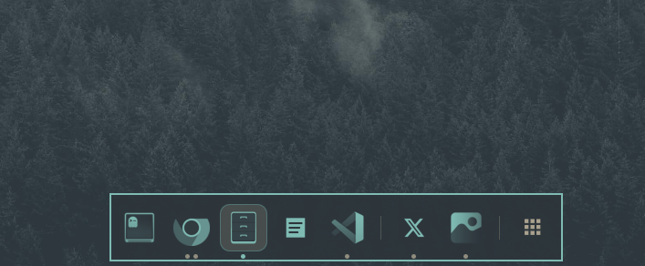

# Omarchy Minimizable Dock



A dock for [Omarchy](https://omarchy.org/) — with theme-matching icons, pinning, minimizing and maximizing.

Your pinned apps sit on the left in the order you choose. Anything else you
have running appears next to them, and the button on the far right opens
Omarchy's app launcher. The icons are re-rendered in your theme's colours, so
the dock changes with the rest of the desktop instead of being a row of clashing
logos.

The dots under each icon are that app's windows. A filled dot is a window on
screen, the accented one is the window you're in, and a hollow dot is one you've
minimized — if every window of an app is minimized, its icon dims too. The
outlined icon is the app you're working in right now.

Clicking an icon does what you'd expect:

- **not running** — launches it
- **running, but you're somewhere else** — brings it forward
- **the app you're in** — minimizes it, and the window leaves the screen
- **everything of that app minimized** — brings the last one back, to the
  workspace it left rather than wherever you happen to be

Hover an icon to see its windows by name and click the one you want. Scroll it
to walk through them. Right-click for minimize all, restore all, pin, and close.

Minimizing is the part Hyprland genuinely cannot do on its own: it has no
minimized window state at all. A minimized window is parked on a hidden
workspace (`special:minimized`), and the dock is what remembers where it came
from and puts it back. `SUPER + M` minimizes without reaching for the mouse.

Nothing extra to install and nothing extra running: the dock lives inside the
Quickshell process Omarchy already starts, and drives Hyprland through its own
IPC.

## Install

Open the Omarchy menu with `SUPER + SPACE`, type `plu`, and pick
**Plugins → Add Plugin**. A small terminal appears and asks for a git URL —
paste this one:

```
https://github.com/bogdart/omarchy-minimizable-dock.git
```

Omarchy reminds you that plugins are unsandboxed code and asks you to confirm,
then downloads it, checks the manifest, and offers to enable it. Say yes and the
dock is there.

Nothing in this repo is executed while it installs: Omarchy runs no setup
scripts from a plugin and never asks for your password.

### Removing or pausing it

The same menu, `SUPER + SPACE` → **Plugins**:

- **Remove Plugin** — deletes it and its entry
- **Disable Plugin** — parks it without deleting it, so **Enable Plugin** brings
  it straight back

<details>
<summary>Prefer a terminal?</summary>

```bash
omarchy plugin add https://github.com/bogdart/omarchy-minimizable-dock.git --enable
omarchy plugin update bogdart.dock    # pull the newest version
omarchy plugin disable bogdart.dock
omarchy plugin remove bogdart.dock
```

</details>

Requirements: Omarchy with the Quickshell shell (`$OMARCHY_PATH/shell`),
Hyprland 0.56 or newer (its Lua IPC is what minimize and focus use), and `jq`.
ImageMagick (`magick`, stock on Omarchy) renders the monochrome icons; without
it the dock falls back to the apps' own colour icons.

### Optional: keyboard shortcuts

The dock needs nothing else to work. It reads this system's terminal, browser,
and file manager for its own defaults, and claims its own Hyprland layer rule
when it starts, so there is no configuration step.

Keyboard shortcuts are the one thing a plugin genuinely cannot set up for
itself, because they live in your Hyprland config and Omarchy never runs code
from a plugin. If you want them, clone the repo and run:

```bash
./shortcuts.sh              # add the keybindings
./shortcuts.sh --dry-run    # show what would change, change nothing
./shortcuts.sh --uninstall  # remove them again
```

| | |
|---|---|
| `SUPER + M` | minimize the focused window to the dock |
| `SUPER + CTRL + M` | restore the last minimized window |
| `SUPER + D` | hide/show the dock |

It touches exactly one file, `~/.config/hypr/bindings.lua`, appending a marked
block. Nothing you already have is rewritten — your existing lines stay where
they are, the file is backed up first, and `--uninstall` removes that block and
nothing else.

One thing to know: because the block is appended, its bindings take precedence
over an earlier binding of the same keys. If any of the three is already bound,
the script warns you and names what it is shadowing rather than deciding for
you; your original line is still in the file and works again once the block is
removed.

Or skip the script and paste this into `~/.config/hypr/bindings.lua` yourself:

```lua
o.bind("SUPER + M", "Minimize window to dock", hl.dsp.window.move({ workspace = "special:minimized", follow = false }))
o.bind("SUPER + CTRL + M", "Restore last minimized window", "omarchy-shell dock restore")
o.bind("SUPER + D", "Toggle dock", "omarchy-shell dock toggle")
```

## Layout

```
[ pinned apps ] │ [ running apps that aren't pinned ] │ [ all apps ]
```

Each icon sits in the exact vertical middle of the card, with the same
breathing room above and below; the window dots live in the padding on the
screen-edge side.

The last cell opens Omarchy's own apps menu (the same one as
`SUPER + ALT + SPACE`); set `"appsButton": false` to drop it.

Under each icon:

| Indicator | Meaning |
|---|---|
| accent dot | that window is focused |
| filled dot | open window on some workspace |
| hollow dot + icon at half opacity | window is minimized (parked on `special:minimized`); the icon dims only when every window of the app is |
| no dot | pinned, not running |

One dot per window, up to four.

## Showing and hiding

By default the dock autohides: it slides away while a window is on the
workspace, and reveals itself when the pointer touches the bottom edge of the
screen. Two things bring it back on their own:

- **an empty workspace** — with nothing on screen there is nothing to hide
  from, so the dock simply stays up (per monitor, so a full screen next to a
  bare one behaves correctly);
- **minimizing a window** — the dock peeks for a moment so it is visible where
  the window just went.

Set `"autohide": false` to keep it on screen permanently instead; that mode
reserves its height, so windows tile above it.

## Mouse

| Action | Result |
|---|---|
| left click, not running | launch the app |
| left click, app holds focus | minimize the window that holds it, however many windows the app has |
| left click, a window is on screen | raise the most recently used one |
| left click, every window minimized | bring one back, most recently minimized first — click again for the next |
| middle click | new window / new instance |
| right click | menu: window list, new window, restore all, minimize all, pin/unpin, close |
| scroll | cycle that app's windows |
| hover | window list — per-window controls: left = switch/restore, right = minimize (list stays open), middle = close |

The hover list is reachable: it opens flush against the dock, the pointer can
walk from the icon into it, and the dock stays put while the pointer is inside
the list or the menu.

## Keys

Set in `~/.config/hypr/bindings.lua`:

| Key | Action |
|---|---|
| `SUPER + M` | minimize the active window to the dock |
| `SUPER + CTRL + M` | restore the most recently minimized window |
| `SUPER + D` | hide/show the dock |

`SUPER + M` is a plain Hyprland dispatcher, so minimizing keeps working even if
the shell is restarted; the dock only supplies the way back.

## Commands

```bash
omarchy-shell dock state        # position, autohide, item count, minimized count
omarchy-shell dock minimized    # list minimized windows
omarchy-shell dock minimize     # minimize the active window
omarchy-shell dock restore      # restore the most recently minimized window
omarchy-shell dock restoreAll   # restore every minimized window
omarchy-shell dock toggle       # hide/show
omarchy-shell dock peek         # reveal briefly (autohide mode)
omarchy-shell dock activate <app>  # act as if that icon were clicked
omarchy-shell dock debug        # per-screen reveal/hover state
```

## Configuration

The dock reads its own entry in `~/.config/omarchy/shell.json` under
`plugins[]`, and picks up edits to that file without a restart:

```json
{
  "id": "bogdart.dock",
  "position": "bottom",
  "autohide": true,
  "iconSize": 40,
  "opacity": 0.92,
  "monochrome": true,
  "onlyCurrentWorkspace": false,
  "appsButton": true,
  "pinned": ["com.mitchellh.ghostty", "chromium", "org.gnome.Nautilus", "obsidian"],
  "aliases": { "org.omarchy.terminal": "com.mitchellh.ghostty" },
  "ignore": []
}
```

| Key | Default | What it does |
|---|---|---|
| `position` | `bottom` | `bottom` or `top` |
| `autohide` | `true` | `true` parks the dock off-screen, revealing it on a pointer at that screen edge, on an empty workspace, and briefly after a minimize. `false` keeps it visible and reserves space so windows tile above it |
| `iconSize` | `40` | icon size in logical pixels (20–96) |
| `opacity` | `0.92` | dock background opacity |
| `monochrome` | `true` | redraw every icon in shades of one theme colour (see below). `false` shows the apps' icons as shipped |
| `monochromeColor` | `frame` | the ink: `frame` is the dock's border colour (the theme accent), `foreground` the theme's text colour |
| `onlyCurrentWorkspace` | `false` | `true` shows only windows on the focused workspace — minimized windows always show |
| `appsButton` | `true` | the trailing button that opens Omarchy's apps menu |
| `pinned` | — | desktop entry ids, in dock order. Right-click → Pin/Unpin edits this list for you |
| `aliases` | — | window class → desktop entry id, for windows whose class has no entry of its own (Omarchy launches terminals as `org.omarchy.terminal`) |
| `ignore` | `[]` | extra window classes to keep out of the dock (`org.quickshell` and `org.omarchy.screensaver` are always ignored) |

Pinned ids are desktop entry ids without `.desktop`; `omarchy plugin list` and
`ls /usr/share/applications ~/.local/share/applications` are the places to find
them.

## Monochrome icons

With `monochrome` on, every app icon is reduced to its luminance, normalised
so each icon spans the full range (a pale icon gets the same depth as a dark
one), and that luminance is mapped onto the ramp between one ink colour and
the theme background. The ink is the dock's own frame colour by default, so
an icon's body is exactly the frame's colour, its highlights fade toward the
background, and nothing in it is ever darker than the frame (on a dark
theme: brighter). `"monochromeColor": "foreground"` uses the theme's text
colour instead.

Renderings are produced once by `icon-mono.sh` (ImageMagick, plus
`rsvg-convert` for SVG sources) and cached in
`~/.cache/bogdart.dock/icons/<px>-<dark>-<light>/`, keyed by icon size and the
ramp's two colours, so the dock only pays for a render the first time it sees
an icon in a given theme:

- **theme change** — the shell's colours change, the cache key changes, and
  the dock renders the new set (the old one stays on disk, so switching back
  is instant);
- **a newly installed app** — its icon is rendered the moment it appears on
  the dock, and the original icon shows until then;
- **icon size, ink, or screen density change** — a new key, a new render.

A source that cannot be rendered keeps its original icon. Folders no theme
has used for two weeks are pruned automatically; delete the whole cache at
any time and it is rebuilt on the next shell start. Removing the plugin leaves
the cache behind — `rm -rf ~/.cache/bogdart.dock` clears it.

## Notes

- Web app windows (Chromium `--app=`) are matched back to their Omarchy
  launcher by URL, so a pinned web app lights up when its window opens.
- Minimized windows survive on the special workspace; nothing unmaps them, so
  a video keeps playing and a build keeps running.
- Restoring returns a window to the workspace it was minimized from and
  focuses it there. Only a window with no remembered home (minimized before
  the shell started) falls back to the current workspace.
- `special:minimized` is deliberately separate from Omarchy's
  `special:scratchpad` (`SUPER + ALT + S`), so the two do not mix.
- Editing this plugin's QML: `shell.json` hot-reloads, but plugin code changes
  need `omarchy restart shell` to take effect reliably.
- A left click resolves in a fixed order: focused beats on-screen, and
  on-screen beats minimized. While an app still has a visible window to switch
  to, a click switches to it rather than digging another one out of the
  minimized workspace; only when nothing of the app is left on screen does a
  click restore, one window per click, so a second parked window stays
  reachable. Walking between an app's windows is the scroll wheel's job.
- A window parked on `special:minimized` never counts as focused, even though
  Hyprland can leave it as the active window when it was the last one on its
  workspace. Counting it would make a click minimize it again, with no way
  back.
- Only *which* icons exist and their order come from a snapshot, rebuilt when
  that structure changes; a snapshot is held back for at most a second while
  the pointer is on the dock so the row cannot reflow under a click. Everything
  the dock *reports* — window counts, focus, the minimized markers, titles,
  icons — is bound to live state, so what you see cannot drift from what
  Hyprland actually has. Every *action* re-reads the app by key for the same
  reason: the snapshot a cell was built from carries focus and minimize state
  frozen at that moment, which is fine for drawing the row and useless for
  deciding what a click means. A stuck pointer state can therefore never leave stale
  indicators on screen, and a watchdog releases hover if a leave event is ever
  missed.
- Files: `Dock.qml` (windows, actions, IPC), `DockItem.qml` (one icon),
  `DockModel.js` (class matching, grouping, and the structural signature).

## License

MIT — see [LICENSE](LICENSE).

External dependencies: none bundled and nothing vendored. At runtime the dock
uses only what Omarchy already ships — Quickshell (it runs as a plugin inside
the existing `omarchy-shell` process), Hyprland 0.56 or newer for its Lua IPC,
`jq` for the installer, and ImageMagick for the monochrome icon rendering, which
it degrades gracefully without. The screenshot in this README is of the author's
own desktop.
